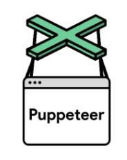

# Puppeteer - Examples

Puppeteer is a Node library to control chrome or chromium browser and perform all possible user actions. Puppeteer can be used to automate web application. It is capable to provide frondend performance attributes.

Currently the aim of this project is to evaluate the puppeteer as a browser automation tool and provide examples to use its functions. Also it facilitates a automation framework to help testers automating their web applications.

The projects is using _typescript_ and _jest_ to run all example tests.

## Functions 

Following functions are used in this project.
* page.launch();

## User defined functions

The plan is to create user defined functions as well. Like for example after performing click, user normally naviagates to new page. so building a function _clickAndNavigate()_ makes more sense.

## AUT(Example website)

To get all possible testing on scenarios. https://the-internet.herokuapp.com/ is used.

## Github Actions
Github action is used to setup pipleline and relevant jobs. refer Actions tab to check the pipeline.

## Best Practices 
lint and prettier is to be implemented.

## Project Structure

## class: Puppeteer 
puppeteer.clearCustomQueryHandlers()
puppeteer.connect(options)
puppeteer.createBrowserFetcher([options])
puppeteer.customQueryHandlerNames()
puppeteer.defaultArgs([options])
puppeteer.devices
puppeteer.errors
puppeteer.executablePath()
puppeteer.launch([options])
puppeteer.product
puppeteer.registerCustomQueryHandler(name, queryHandler)
puppeteer.unregisterCustomQueryHandler(name)

## class: BrowserFetcher
browserFetcher.canDownload(revision)
browserFetcher.download(revision[, progressCallback])
browserFetcher.host()
browserFetcher.localRevisions()
browserFetcher.platform()
browserFetcher.product()
browserFetcher.remove(revision)
browserFetcher.revisionInfo(revision)
## class: Browser
event: 'disconnected' - Done 
event: 'targetchanged' - Done 
event: 'targetcreated' - Done 
event: 'targetdestroyed' - Done 
browser.browserContexts()
browser.close()
browser.createIncognitoBrowserContext() - Done 
browser.defaultBrowserContext() - Done 
browser.disconnect()
browser.isConnected()
browser.newPage() - Done 
browser.pages() - Done 
browser.process()
browser.target()
browser.targets()
browser.userAgent()
browser.version()
browser.waitForTarget(predicate[, options])
browser.wsEndpoint() - Done 

## class: BrowserContext
event: 'targetchanged' 
event: 'targetcreated'
event: 'targetdestroyed'
browserContext.browser()
browserContext.clearPermissionOverrides()
browserContext.close()
browserContext.isIncognito()
browserContext.newPage()
browserContext.overridePermissions(origin, permissions)
browserContext.pages()
browserContext.targets()
browserContext.waitForTarget(predicate[, options])

## class: Page
event: 'close' - Done 
event: 'console' - Done 
event: 'dialog' - Done 
event: 'domcontentloaded' - Done 
event: 'error'
event: 'frameattached' - Done 
event: 'framedetached'
event: 'framenavigated'
event: 'load' - Done 
event: 'metrics'
event: 'pageerror' - Done 
event: 'popup'
event: 'request' - Done 
event: 'requestfailed' - Done 
event: 'requestfinished' - Done 
event: 'response' - Done 
event: 'workercreated'
event: 'workerdestroyed'
page.$(selector) - Done 
page.$$(selector) - Done 
page.$$eval(selector, pageFunction[, ...args]) - Done 
page.$eval(selector, pageFunction[, ...args]) - Done 
page.$x(expression)-Done 
page.accessibility
page.addScriptTag(options) - Done 
page.addStyleTag(options) - Done 
page.authenticate(credentials) - Done 
page.bringToFront()
page.browser()
page.browserContext()
page.click(selector[, options]) - Done 
page.close([options])
page.content() - Done 
page.cookies([...urls])
page.coverage
page.deleteCookie(...cookies)
page.emulate(options) - Done 
page.emulateIdleState(overrides)
page.emulateMediaFeatures(features)
page.emulateMediaType(type)
page.emulateTimezone(timezoneId)
page.emulateVisionDeficiency(type)
page.evaluate(pageFunction[, ...args]) - Done 
page.evaluateHandle(pageFunction[, ...args])
page.evaluateOnNewDocument(pageFunction[, ...args])
page.exposeFunction(name, puppeteerFunction)
page.focus(selector)
page.frames()
page.goBack([options])
page.goForward([options])
page.goto(url[, options]) - Done 
page.hover(selector)
page.isClosed()
page.isJavaScriptEnabled()
page.keyboard
page.mainFrame()
page.metrics()
page.mouse
page.pdf([options])
page.queryObjects(prototypeHandle)
page.reload([options])
page.screenshot([options])
page.select(selector, ...values)
page.setBypassCSP(enabled)
page.setCacheEnabled([enabled])
page.setContent(html[, options])
page.setCookie(...cookies)
page.setDefaultNavigationTimeout(timeout)
page.setDefaultTimeout(timeout)
page.setExtraHTTPHeaders(headers) - Done 
page.setGeolocation(options)
page.setJavaScriptEnabled(enabled)
page.setOfflineMode(enabled)
page.setRequestInterception(value)
page.setUserAgent(userAgent)
page.setViewport(viewport)
page.tap(selector) - Done 
page.target()
page.title() - Done 
page.touchscreen
page.tracing
page.type(selector, text[, options])
page.url() - Done 
page.viewport() 
page.waitFor(selectorOrFunctionOrTimeout[, options[, ...args]])
page.waitForFileChooser([options])
page.waitForFunction(pageFunction[, options[, ...args]]) - Done 
page.waitForNavigation([options]) - Done 
page.waitForRequest(urlOrPredicate[, options])
page.waitForResponse(urlOrPredicate[, options])
page.waitForSelector(selector[, options]) - Done 
page.waitForTimeout(milliseconds)
page.waitForXPath(xpath[, options])
page.workers()
GeolocationOptions
WaitTimeoutOptions
## class: WebWorker

webWorker.evaluate(pageFunction[, ...args])
webWorker.evaluateHandle(pageFunction[, ...args])
webWorker.executionContext()
webWorker.url()
## class: Accessibility
accessibility.snapshot([options])
## class: Keyboard
keyboard.down(key[, options])
keyboard.press(key[, options])
keyboard.sendCharacter(char)
keyboard.type(text[, options])
keyboard.up(key)
## class: Mouse
mouse.click(x, y[, options])
mouse.down([options])
mouse.move(x, y[, options])
mouse.up([options])
mouse.wheel([options])
## class: Touchscreen
touchscreen.tap(x, y)
## class: Tracing
tracing.start([options])
tracing.stop()
## class: FileChooser
fileChooser.accept(filePaths)
fileChooser.cancel()
fileChooser.isMultiple()
## class: Dialog
dialog.accept([promptText])
dialog.defaultValue()
dialog.dismiss()
dialog.message()
dialog.type()
## class: ConsoleMessage
consoleMessage.args()
consoleMessage.location()
consoleMessage.stackTrace()
consoleMessage.text()
consoleMessage.type()
## class: Frame
frame.$(selector)
frame.$$(selector)
frame.$$eval(selector, pageFunction[, ...args])
frame.$eval(selector, pageFunction[, ...args])
frame.$x(expression)
frame.addScriptTag(options)
frame.addStyleTag(options)
frame.childFrames()
frame.click(selector[, options])
frame.content()
frame.evaluate(pageFunction[, ...args])
frame.evaluateHandle(pageFunction[, ...args])
frame.executionContext()
frame.focus(selector)
frame.goto(url[, options])
frame.hover(selector)
frame.isDetached()
frame.name()
frame.parentFrame()
frame.select(selector, ...values)
frame.setContent(html[, options])
frame.tap(selector)
frame.title()
frame.type(selector, text[, options])
frame.url()
frame.waitFor(selectorOrFunctionOrTimeout[, options[, ...args]])
frame.waitForFunction(pageFunction[, options[, ...args]])
frame.waitForNavigation([options])
frame.waitForSelector(selector[, options])
frame.waitForTimeout(milliseconds)
frame.waitForXPath(xpath[, options])
class: ExecutionContext
executionContext.evaluate(pageFunction[, ...args])
executionContext.evaluateHandle(pageFunction[, ...args])
executionContext.frame()
executionContext.queryObjects(prototypeHandle)
## class: JSHandle

jsHandle.asElement()
jsHandle.dispose()
jsHandle.evaluate(pageFunction[, ...args])
jsHandle.evaluateHandle(pageFunction[, ...args])
jsHandle.executionContext()
jsHandle.getProperties()
jsHandle.getProperty(propertyName)
jsHandle.jsonValue()

## class: ElementHandle
elementHandle.$(selector)
elementHandle.$$(selector)
elementHandle.$$eval(selector, pageFunction[, ...args])
elementHandle.$eval(selector, pageFunction[, ...args])
elementHandle.$x(expression)
elementHandle.asElement()
elementHandle.boundingBox() - Done 
elementHandle.boxModel()
elementHandle.click([options]) - Done
elementHandle.contentFrame()
elementHandle.dispose()
elementHandle.evaluate(pageFunction[, ...args])
elementHandle.evaluateHandle(pageFunction[, ...args])
elementHandle.executionContext()
elementHandle.focus()
elementHandle.getProperties()
elementHandle.getProperty(propertyName) - Done 
elementHandle.hover()
elementHandle.isIntersectingViewport()
elementHandle.jsonValue() - Done
elementHandle.press(key[, options])
elementHandle.screenshot([options])
elementHandle.select(...values)
elementHandle.tap()
elementHandle.toString()
elementHandle.type(text[, options])
elementHandle.uploadFile(...filePaths)
## class: HTTPRequest

httpRequest.abort([errorCode])
httpRequest.continue([overrides])
httpRequest.failure()
httpRequest.frame()
httpRequest.headers()
httpRequest.isNavigationRequest()
httpRequest.method()
httpRequest.postData()
httpRequest.redirectChain()
httpRequest.resourceType()
httpRequest.respond(response)
httpRequest.response()
httpRequest.url()

## class: HTTPResponse

httpResponse.buffer()
httpResponse.frame()
httpResponse.fromCache()
httpResponse.fromServiceWorker()
httpResponse.headers()
httpResponse.json()
httpResponse.ok()
httpResponse.remoteAddress()
httpResponse.request()
httpResponse.securityDetails()
httpResponse.status()
httpResponse.statusText()
httpResponse.text()
httpResponse.url()

## class: SecurityDetails
securityDetails.issuer()
securityDetails.protocol()
securityDetails.subjectAlternativeNames()
securityDetails.subjectName()
securityDetails.validFrom()
securityDetails.validTo()

## class: Target

target.browser()
target.browserContext()
target.createCDPSession()
target.opener()
target.page()
target.type()
target.url()
target.worker()

## class: CDPSession

cdpSession.detach()
cdpSession.send(method[, ...paramArgs])

## class: Coverage

coverage.startCSSCoverage([options])
coverage.startJSCoverage([options])
coverage.stopCSSCoverage()
coverage.stopJSCoverage()
## class: TimeoutError
## class: EventEmitter

eventEmitter.addListener(event, handler)
eventEmitter.emit(event, [eventData])
eventEmitter.listenerCount(event)
eventEmitter.off(event, handler)
eventEmitter.on(event, handler)
eventEmitter.once(event, handler)
eventEmitter.removeAllListeners([event])
eventEmitter.removeListener(event, handler)
interface: CustomQueryHandler

